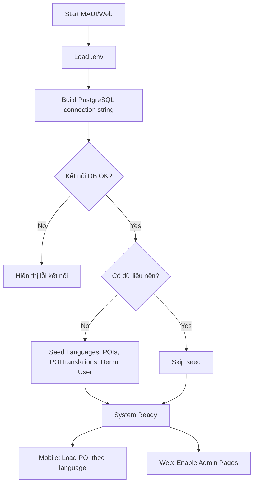
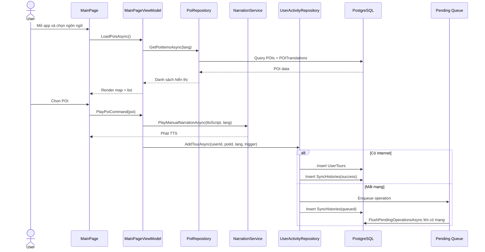
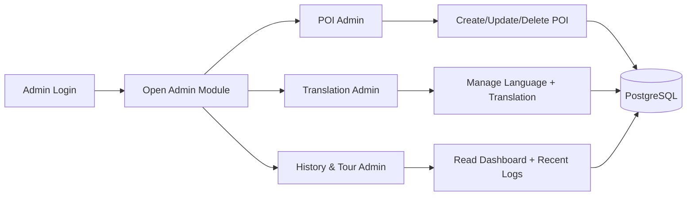
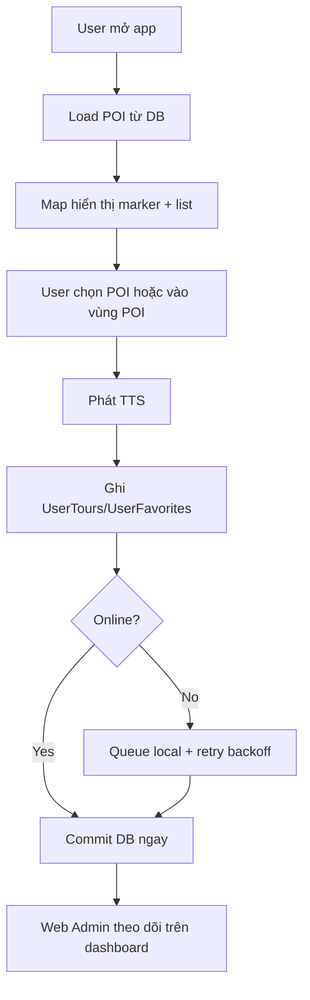

# PID - FOOD_MAP

## 1. Tổng quan dự án

FOOD_MAP là hệ thống bản đồ du lịch kết hợp thuyết minh âm thanh, tập trung vào trải nghiệm khám phá các điểm tham quan (POI) theo vị trí. Dự án gồm:

- Ứng dụng di động đa nền tảng bằng .NET MAUI (Android, iOS, MacCatalyst, Windows).
- Khối dùng chung (Shared) cho model, DbContext và UI dùng lại.
- Cổng Web Admin để quản trị POI, ngôn ngữ bản dịch và theo dõi hành vi người dùng.
- Cơ sở dữ liệu PostgreSQL dùng chung cho Mobile và Web.

## 2. Bối cảnh và bài toán

### Bối cảnh

Người dùng khi tham quan cần:

- Xác định nhanh điểm đến trên bản đồ.
- Nghe mô tả điểm đến theo ngôn ngữ phù hợp.
- Lưu POI yêu thích và lịch sử tham quan.

Ban quản trị nội dung cần:

- Cập nhật POI, tọa độ, bán kính kích hoạt, nội dung đa ngôn ngữ.
- Theo dõi dashboard về hoạt động người dùng.

### Bài toán chính

- Đồng bộ trải nghiệm giữa Mobile và Web trên cùng một nguồn dữ liệu.
- Hỗ trợ nhiều ngôn ngữ cho cùng một POI.
- Đảm bảo ứng dụng vẫn hoạt động ổn khi mạng không ổn định.

## 3. Mục tiêu dự án

### Mục tiêu nghiệp vụ

- Cung cấp hướng dẫn tham quan trực quan qua bản đồ và nội dung thuyết minh.
- Tăng mức độ tương tác thông qua yêu thích POI và lịch sử tour.
- Giảm thời gian cập nhật nội dung bằng giao diện Admin trực tiếp.

### Mục tiêu kỹ thuật

- Dùng kiến trúc dùng chung model dữ liệu giữa App và Web.
- Chuẩn hóa PostgreSQL schema cho dữ liệu POI, bản dịch, tài sản media và hoạt động user.
- Tự động seed dữ liệu ban đầu để giảm ma sát khi chạy môi trường mới.

## 4. Phạm vi

### In-scope

- Hiển thị bản đồ, marker POI, chọn POI và xem chi tiết.
- Chọn ngôn ngữ (ít nhất vi/en), tìm kiếm POI theo tên/mô tả.
- Phát TTS nội dung POI.
- Đăng ký, đăng nhập, guest mode.
- Đánh dấu yêu thích, lưu lịch sử tour.
- Web Admin: CRUD POI, CRUD Language/Translation, dashboard lịch sử.
- Dùng PostgreSQL cho lưu trữ trung tâm.

### Out-of-scope (giai đoạn hiện tại)

- Streaming audio nâng cao từ CDN riêng.
- AI recommendation hoặc cá nhân hóa sâu.
- Cơ chế phân quyền nhiều vai trò phức tạp.

## 5. Kiến trúc hệ thống

### 5.1 Thành phần

- FOOD_MAP (MAUI App): giao diện người dùng cuối, map, location, TTS, session user.
- FOOD_MAP.Shared: model dữ liệu, DbContext, layout/trang dùng chung.
- FOOD_MAP.Web (Blazor Server): giao diện quản trị và dashboard.
- PostgreSQL: dữ liệu trung tâm cho POI, translation, user, favorite, tour.

### 5.2 Luồng xử lý mức cao

1. App/Web khởi động và nạp biến môi trường từ file .env (nếu có).
2. Build connection string PostgreSQL theo biến môi trường.
3. Mobile gọi seed dữ liệu nếu DB trống.
4. App tải POI + translation theo ngôn ngữ, render map/list.
5. Khi user tương tác (favorite, tour), dữ liệu ghi DB; nếu offline sẽ vào hàng đợi pending và flush lại khi có mạng.
6. Web Admin đọc cùng DB để quản trị nội dung và xem thống kê.

### 5.3 RM - Theo cấu trúc presentation HTML

RM được viết lại theo phong cách gần giống file presentation: chia theo các cụm luồng vận hành chính thay vì gom toàn bộ vào một sơ đồ duy nhất.

#### 5.3.1 RM-01: Luồng khởi động hệ thống (App + Web)

#### 5.3.2 RM-02: Luồng runtime người dùng Mobile (POI + TTS + Sync)

#### 5.3.3 RM-03: Luồng quản trị nội dung Web Admin

#### 5.3.4 RM-04: End-to-End tích hợp (từ mở app đến lưu hoạt động)

Ghi chú bám theo cấu trúc HTML:

- RM tách thành nhiều flow chuyên biệt giống phong cách chapter-based của file presentation.
- Mỗi flow có vai trò rõ ràng: startup, runtime mobile, admin runtime, end-to-end.
- Nhánh online/offline được giữ lại như điểm nhấn kiến trúc vận hành thực tế.

## 6. Chức năng chính

### 6.1 Ứng dụng người dùng (Mobile)

- Bản đồ POI với bottom sheet thao tác.
- Chọn tab POI/Camera, tìm kiếm và lọc theo ngôn ngữ.
- Chạy TTS cho nội dung giới thiệu.
- Theo dõi vị trí (Android) và di chuyển camera map tới POI.
- Quản lý session: guest hoặc user đăng nhập.
- Lưu favorite và lịch sử tour của user.

### 6.2 Cổng quản trị (Web Admin)

- POI Admin:
	- Tạo/sửa/xóa POI: tọa độ, bán kính kích hoạt, priority, QRCode.
	- Quản lý nội dung tiếng Việt nền cho POI.
- Translation Admin:
	- Quản lý ngôn ngữ hỗ trợ.
	- Quản lý bản dịch POI theo từng language.
- History & Tour Admin:
	- Dashboard tổng quan users/favorites/tours.
	- Top user theo tour.
	- Bảng recent favorites và recent tours.

## 7. Mô hình dữ liệu chính

- Languages: danh mục ngôn ngữ.
- POIs: dữ liệu lõi điểm tham quan.
- POITranslations: nội dung đa ngôn ngữ cho từng POI.
- MediaAssets: metadata file media theo translation.
- Users: tài khoản người dùng.
- UserFavorites: POI user đánh dấu yêu thích.
- UserTours: lịch sử tham quan/tương tác theo thời gian.
- SyncHistories: lịch sử đồng bộ và lỗi.

## 8. Công nghệ sử dụng

- .NET 10
- .NET MAUI + BlazorWebView
- Blazor Server (Web Admin)
- Entity Framework Core + Npgsql
- PostgreSQL
- Microsoft MAUI Maps
- TextToSpeech API

## 9. Quy ước cấu hình môi trường

Các biến chính:

- POSTGRES_HOST
- POSTGRES_PORT
- POSTGRES_DATABASE
- POSTGRES_USER
- POSTGRES_PASSWORD
- ConnectionStrings__DefaultConnection
- GOOGLE_MAPS_API_KEY

Ghi chú Android Emulator:

- Có cơ chế chuẩn hóa host loopback về 10.0.2.2 khi cần để kết nối DB từ emulator.

## 10. Chất lượng và phi chức năng

- Khả dụng:
	- Timeout kết nối DB ngắn để tránh treo UI khi DB không sẵn sàng.
- Tính nhất quán dữ liệu:
	- Unique index cho các cặp khóa quan trọng (PoiId + LanguageId, UserId + PoiId).
- Chịu lỗi mạng:
	- Có queue pending cho favorite/tour và cơ chế retry backoff.
- Bảo mật mức cơ bản:
	- Mật khẩu lưu dạng hash, không lưu plain text.

## 11. Rủi ro và hướng giảm thiểu

- Rủi ro kết nối DB từ thiết bị di động:
	- Giảm thiểu: chuẩn hóa host theo nền tảng, timeout thấp, thông báo lỗi rõ ràng.
- Rủi ro dữ liệu seed ghi đè:
	- Giảm thiểu: chỉ seed khi chưa có dữ liệu nền.
- Rủi ro duplicate lịch sử tour do thao tác liên tiếp:
	- Giảm thiểu: chống duplicate theo cửa sổ thời gian ngắn.
- Rủi ro nội dung translation không đầy đủ:
	- Giảm thiểu: fallback ngôn ngữ en/vi khi thiếu bản dịch.

