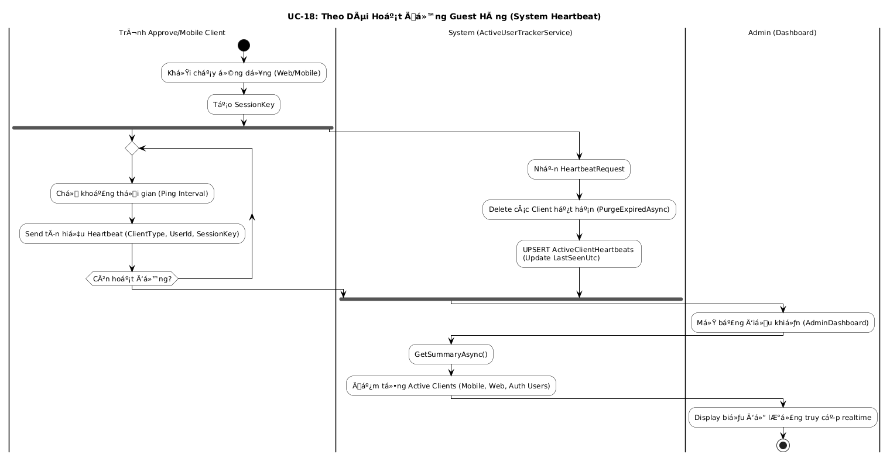
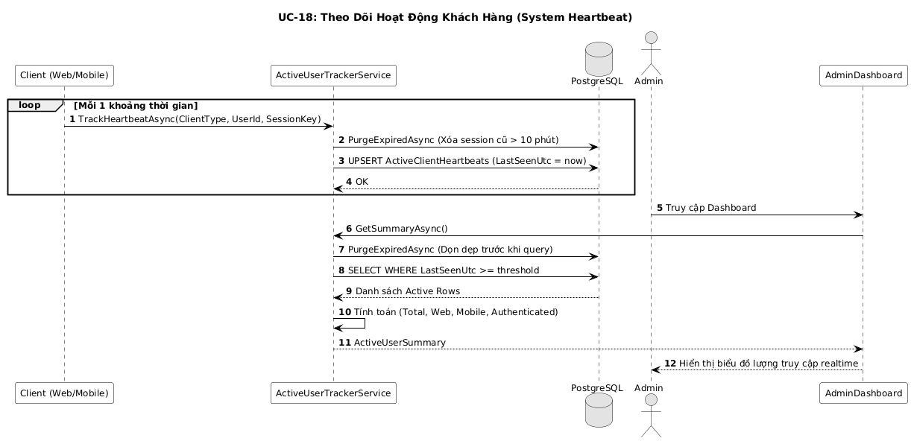

# PRODUCT REQUIREMENTS DOCUMENT: FOOD MAP

## 1. OVERVIEW

**FOOD MAP** is a smart tourism map application that helps visitors easily find, navigate, and interact with Points of Interest (POIs) via audio narration (TTS), QR code scanning, and food menu browsing. The system consists of:

- A cross-platform mobile application built with **.NET MAUI** (Android primary target).
- A shared library **FOOD_MAP.Shared** for data models, DbContext, and reusable Razor UI components.
- A **Blazor Server Web Admin (CMS)** for managing POI content, translations, subscriptions, and monitoring.
- A **Remote PostgreSQL** database shared by both the mobile app and the web.

**Project Goals:**
- Digitize on-site tourism experiences (Auto TTS narration, QR scanning, GPS-based POI alerts, food menus).
- Operate stably even under unstable network conditions (Offline Queue Sync).
- Support multilingual content through a language ownership and contributor mechanism.
- Provide a Subscription/Payment model for Owner-tier accounts with feature unlocking.

---

## 2. SYSTEM ARCHITECTURE

The project is built on **.NET MAUI** and a **Remote PostgreSQL** database following a Clean Architecture pattern (Repository Pattern), with support for background sync when connectivity is lost.

| Layer | Component | Responsibility |
| --- | --- | --- |
| **Presentation** | MainTabsPage, HomePage, PoiPage, CameraPage, MapPage, LoginPage, RegisterPage, SettingsPage | UI rendering and user interaction |
| **ViewModel** | MainPageViewModel, SettingsViewModel, LoginViewModel | UI business logic, Data binding |
| **Service** | AuthService, NarrationService, DataService, MobileApiServices, ActiveMobileHeartbeatAgent | Core application logic and cross-cutting features |
| **Repository** | PoiRepository, UserActivityRepository, SyncQueue | Data access and Offline Queue management |
| **Data** | AppDbContext (EF Core + Npgsql), Remote PostgreSQL | Persistent data layer |

---

## 3. SYSTEM ACTORS

The system serves a diverse set of user types through 4 main roles:

| Actor | Description | Permissions |
| --- | --- | --- |
| **Guest** | Anonymous visitor | View the POI map, scan QR codes, listen to TTS narration, view food menus. Cannot save data. |
| **User** | Registered & logged-in | All Guest permissions + Save Favorites, record Tour History, update Profile, upgrade Subscription. |
| **Owner** | Admin-approved business operator | All User permissions + Create/Edit own POIs, manage Restaurant Menus, request language translation rights, purchase subscription plans. |
| **Admin** | System administrator | Full access: Approve/Reject POIs, approve Owners, manage language ownership, manage all Subscription plans and transactions. |

---

## 4. FUNCTIONAL STRUCTURE & LIFECYCLE

The system is branched and built around 3 core data types: **User Identity, Location Data (POI), and Food Menu Data**.

### 4.1 Dependency Tree

This diagram illustrates why the absence of the 3 root entities (User, POI, FoodItem) prevents all symbiotic features (Subscription, QR, Offline Sync) from functioning.

### 4.2 Product Experience Lifecycle

The activity flow diagram shows data circulation in real-time across 18 standardized use case processes — from content preparation by the admin team to the moment a tourist uses the app on-site.

---

## 5. DATA MODEL (ERD)

The entity relationship diagram for the project with Remote PostgreSQL.

| Table | Description | Purpose |
| --- | --- | --- |
| **Users** | User accounts | Authentication, role management |
| **POIs** | Points of interest / restaurants | Core geolocation and general data |
| **POITranslations** | Translated content | Multi-language name, description, TTS script, audio URL |
| **Languages** | Supported languages | Language catalog for translation |
| **FoodItems** | Individual food items | Linked per POI for restaurant menus |
| **TourList** | Ordered POI lists | A curated sequence of POIs forming a tour itinerary |
| **UserTours** | Tour history log | Tracks user visits per POI with timestamp |
| **UserFavorites** | Favorites log | Tracks user-favorited POIs |
| **MediaAssets** | Media file metadata | Cached image/audio file references per translation |
| **SyncHistories** | Sync log | Records background sync events and errors |
| **SubscriptionPlans** | Subscription tiers | Defines feature limits and fixed pricing (Admin-managed) |
| **PaymentTransactions** | Payment records | Logs every payment with a unique TransactionCode |

---

## 6. ACTIVITY DIAGRAMS — 18 Features

<b>Click to expand all 18 Activity Diagrams</b>

### 6.1 Login / Register / Continue as Guest

### 6.2 View POI Map

### 6.3 Search for a Location

### 6.4 Play TTS Narration

### 6.5 Scan QR Code

### 6.6 GPS Navigation & Tour Recording

### 6.7 Mark as Favorite

### 6.8 Change Language

### 6.9 View Food Menu

### 6.10 Manage Profile

### 6.11 Register as a Business Owner

### 6.12 Manage POI (Owner)

### 6.13 Manage Food Menu (Food Manager)

### 6.14 Request Translation Language Rights

### 6.15 Admin Approval Workflow

### 6.16 Offline Data Auto-Sync

### 6.17 Subscription Plan Management

### 6.18 Active User Tracking

---

## 7. SEQUENCE DIAGRAMS — 18 Features

<b>Click to expand all 18 Sequence Diagrams</b>

### 7.1 Login / Register

### 7.2 View POI Map

### 7.3 Search for a Location

### 7.4 Play TTS Narration

### 7.5 Scan QR Code

### 7.6 GPS Navigation & Tour Recording

### 7.7 Mark as Favorite

### 7.8 Change Language

### 7.9 View Food Menu

### 7.10 Manage Profile

### 7.11 Register as a Business Owner

### 7.12 Manage POI (Owner)

### 7.13 Manage Food Menu (Food Manager)

### 7.14 Request Translation Language Rights

### 7.15 Admin Approval Workflow

### 7.16 Offline Data Auto-Sync

### 7.17 Subscription Plan Management

### 7.18 Active User Tracking

---

## 8. STATE TRANSITIONS

### 8.1 POI Lifecycle States
| From State | Action | To State |
| --- | --- | --- |
| (new) | Owner submits a POI | Pending |
| Pending | Admin reviews and approves | Approved |
| Pending | Admin rejects (invalid info) | Rejected |

### 8.2 Owner Verification States
| From State | Action | To State |
| --- | --- | --- |
| (new) | User submits business registration | Pending |
| Pending | Admin verifies and approves | Approved + Role: Owner |

### 8.3 Offline Sync Queue States
| State | Description |
| --- | --- |
| Queued | Operation saved locally, waiting for connectivity. |
| Processing | HTTP request in progress with retry policy. |
| Flushed | Successfully sent to server, local record cleared. |
| Retry | HTTP timeout occurred, re-queued with exponential backoff (2^n). |

### 8.4 Subscription Payment States
| From State | Action | To State |
| --- | --- | --- |
| (new) | Owner selects a plan and initiates payment | Pending |
| Pending | Payment Provider confirms transaction | Active |
| Active | Billing period expires (checked by cron job) | Expired |

---

## 9. KEY TECHNICAL RULES

### Subscription & Billing
- Subscription plan prices are **fixed** and visible to Owners as read-only.
- **Only Admins** can create, modify, or delete subscription plans.
- Each payment generates a **unique, non-repeating `TransactionCode`** stored in `PaymentTransactions`.

### Role-Based UI Visibility (Web CMS)
- **Guests / Users**: Can only access the public `PoiScanner` page (view POI info, play TTS in browser).
- **Owners**: Access CMS to manage their own POIs, view Heatmaps, and make payments. Cannot view active user counts.
- **Admins**: Full access to all CMS pages including the real-time active user dashboard.

### Deep Linking
- Scanning a QR code with a native phone camera opens the MAUI app directly if installed.
- Falls back to the `PoiScanner` web page if the app is not installed.

### Real-time Active User Tracking
- Implemented via SignalR/WebSockets.
- Users become `inactive` within **1 second** of logging out, closing the app, or losing internet.
- This metric is **exclusively visible to Admins**.

### Environment & Security
- All sensitive data (DB connection strings, API keys, payment secrets) must be stored in `.env` files.
- `.env` files are **excluded from version control** via `.gitignore`.
- Passwords are stored as salted hashes — never plain text.
